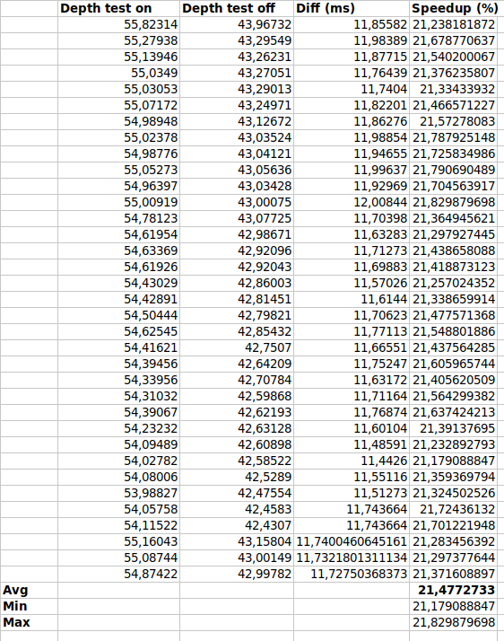

# Z-buffer fill test

*01 Oct 2022*
*Written by tykkiman*

**Question:** How much does not using the Z-buffer speed up triangle drawing on the N64?

**Answer**: Disabling the Z-test and writes gives a **24% speedup**, varying between 12% and 34%.

This test draws a cube 20 times in a loop with and without Z-testing. Tested with a PAL console, 64drive, average of single runs 31 samples. Speedup means here the formula

    speedup = 100 % * (before - after) / before


The test rendering is a zoomed-in cube:


The render loop is

```c
uint32_t t_start = TICKS_READ();
for (int i = 0; i < num_overdraw; i++) {
    render_just_cube();
}
rspq_flush();
uint32_t t_end = TICKS_READ();
```

See [gldemo.c](https://github.com/kannoneer/libdragon/blob/ztester/examples/gldemo/gldemo.c) for details.


## Caveats

- The "overdraw" rendering loop may not be close to reality and loop iterations are probably interfering with each other
- Disabling z-test gives could give some GL-implementation specific speedup not related to triangle rasterization's memory bandwidth use

## Numbers

The test outputs these values:



The spreadsheet: [recording.gnumeric](recording.gnumeric)